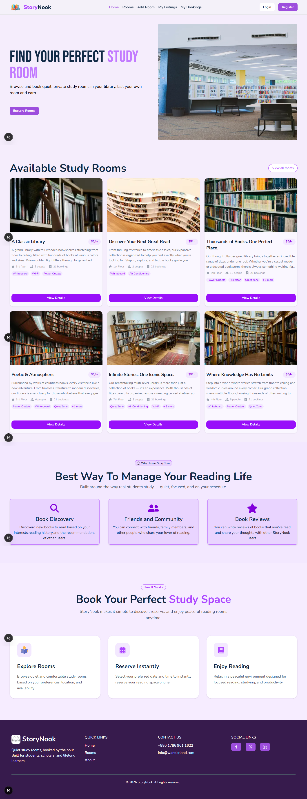

# 📚 StoryNook

> **Quiet study rooms, booked by the hour. Built for students, scholars, and lifelong learners.**

StoryNook is a full-stack web application that lets users discover, list, and book quiet private study rooms in libraries. Think of it as an Airbnb for study spaces — browse available rooms, filter by amenities, and reserve your perfect reading nook in seconds.

---

## Screenshots



## Features

- **Browse & Filter Rooms** — Search by name, filter by amenities (Wi-Fi, Projector, Whiteboard, Quiet Zone, Air Conditioning, Power Outlets), and set a price range
- **Room Detail Page** — View full description, amenities, capacity, floor info, hourly rate, and host details
- **Instant Booking** — Reserve a room by selecting date and time slot; total cost calculated automatically
- **List Your Own Room** — Add a study room with name, description, image, floor, capacity, hourly rate, and amenities
- **My Listings** — Manage all rooms you've listed; edit or delete anytime
- **My Bookings** — View all upcoming and past reservations with date, time, and cost
- **Authentication** — Email/password login & registration, Google OAuth sign-in
- **User Profile Dropdown** — Quick access to listings, bookings, and logout

---

## Tech Stack

| Layer              | Technology                                  |
| ------------------ | ------------------------------------------- |
| **Framework**      | [Next.js 16](https://nextjs.org/)           |
| **Language**       | JavaScript / React 19                       |
| **Styling**        | [Tailwind CSS v4](https://tailwindcss.com/) |
| **UI Components**  | [HeroUI](https://heroui.com/)               |
| **Authentication** | [Better Auth](https://better-auth.com/)     |
| **Database**       | MongoDB                                     |
| **Icons**          | React Icons                                 |
| **Date Utilities** | date-fns                                    |

---

## Project Structure

```
storynook-app/
├── app/
│   ├── page.js
│   ├── rooms/
│   ├── rooms/[id]/
│   ├── add-room/
│   ├── my-listings/
│   ├── my-bookings/
│   ├── login/
│   └── register/
├── components/
│   ├── Navbar.jsx
│   ├── Footer.jsx
│   ├── RoomCard.jsx
│   └── ...
├── lib/
├── public/
└── package.json
```

---

## Getting Started

### Prerequisites

- Node.js 18+
- MongoDB instance (local or [MongoDB Atlas](https://www.mongodb.com/atlas))
- Google OAuth credentials (optional, for Google sign-in)

### Installation

```bash
# 1. Clone the repository
git clone https://github.com/IamPial/storynook-app.git
cd storynook-app

# 2. Install dependencies
npm install

# 3. Set up environment variables
cp .env.example .env.local
```

### Environment Variables

Create a `.env.local` file in the root directory:

```env
# MongoDB
MONGODB_URI=mongodb+srv://<username>:<password>@cluster.mongodb.net/storynook

# Better Auth
BETTER_AUTH_SECRET=your_secret_key_here
BETTER_AUTH_URL=http://localhost:3000

# Google OAuth (optional)
GOOGLE_CLIENT_ID=your_google_client_id
GOOGLE_CLIENT_SECRET=your_google_client_secret

# App URL
NEXT_PUBLIC_APP_URL=http://localhost:3000
```

### Running the App

```bash
# Development
npm run dev

# Production build
npm run build
npm start
```

Open [http://localhost:3000](http://localhost:3000) in your browser.

---

## Pages Overview

| Route          | Description                                       |
| -------------- | ------------------------------------------------- |
| `/`            | Home — hero section, featured rooms, how it works |
| `/rooms`       | All rooms with search & filter sidebar            |
| `/rooms/[id]`  | Room detail page with booking panel               |
| `/add-room`    | Form to list a new study room                     |
| `/my-listings` | Manage your listed rooms                          |
| `/my-bookings` | View and cancel your reservations                 |
| `/login`       | Email + Google login                              |
| `/register`    | Create a new account                              |

---
